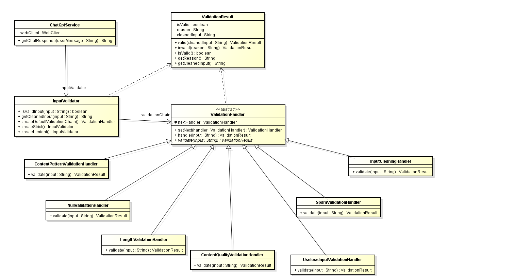

# Java Input Validator

This is a Java library that uses the **Chain of Responsibility** design pattern to validate and clean user input before it is processed (e.g., sent to a language model or backend system). It includes modular validation steps like length checks, spam filtering, useless input detection, and content quality analysis.

## Getting Started

These instructions will help you get a copy of the project running on your local machine for development and testing purposes.

### Prerequisites

You will need the following installed:

- [Java 17+](https://jdk.java.net/)
- [Maven 3.8+](https://maven.apache.org/install.html)
- Git (optional, for cloning)
- An ChatGpt Api Key for this create a .env file and create a variable called API_KEY and paste the key

### API REST
There are two endpoints in this project.

* /api/ask?question=<question> this is an ednpoint to ask to ChatGpt without input validation.
* /api/enhanced/ask?question=<question> this is an ednpoint to ask to ChatGpt with input validation.

#### Deployed App
https://chatgptservice-gpbzgkd7anadbhee.westus-01.azurewebsites.net/

### Installing

Clone the repository:

```bash
git clone https://github.com/thesrcielos/ChatGptInputValidator
cd ChatGptInputValidator
```

### Build the project using Maven:
```
mvn clean install
```

### Running the Application
This is a library, so you include it as a dependency or run usage examples via your own entry point.

Example usage:

```
InputValidator validator = new InputValidator();
ValidationResult result = validator.validateInput("Hello, how are you doing today?");
if (result.isValid()) {
    System.out.println("Cleaned input: " + result.getCleanedInput());
} else {
    System.out.println("Invalid: " + result.getReason());
}
```

## Design
This project follows the Chain of Responsibility design pattern.

Each validation step is implemented as a separate handler class:

    NullValidationHandler

    InputCleaningHandler

    LengthValidationHandler

    ContentPatternValidationHandler

    SpamValidationHandler

    UselessInputValidationHandler

    ContentQualityValidationHandler

A builder is provided to compose validation chains programmatically.



### Example Configurations
```
InputValidator strictValidator = InputValidator.createStrict();
InputValidator lenientValidator = InputValidator.createLenient();
```
Or use a custom builder:
```
InputValidator custom = InputValidator.builder()
    .addNullValidation()
    .addInputCleaning()
    .addLengthValidation(5, 1000)
    .addSpamValidation(5)
    .addContentQualityValidation(0.4)
    .build();
```


## 📚 Javadoc

Code documentation is available in `target/site/apidocs/index.html` after running the command:

```bash
mvn javadoc:javadoc
````


## Built With

* [Java 17](https://www.oracle.com/java/technologies/javase/jdk17-archive-downloads.html)

* [Maven](https://maven.apache.org/) - Dependency Management

* [ JUnit 5](https://junit.org/junit5/)

## Contributing

Please read **CONTRIBUTING.md** for details on how to contribute.

## Authors

* Diego Armando Macia Diaz – Initial work

## License

* This project is licensed under the GNU License – see the LICENSE.md file.
